# Userstyles-DeepDark

Host your code in the dark. May the dark be kinder on thine eyes. (userstyles.org dark theme)

This is a dark theme for userstyles.org inspired by [FT DeepDark](https://addons.mozilla.org/en-US/firefox/addon/ft-deepdark/?src=search). 

Also, credit where credit is due for the color palettes down bellow. ([@KDE](https://github.com/KDE), [@horst3180](https://github.com/horst3180), [@linuxmint](https://github.com/linuxmint), [Firefox](https://www.mozilla.org/en-US/firefox/new/), [YouTube](https://www.youtube.com/) and [Discord](https://discordapp.com/))

Theme as a userstyle [here](https://userstyles.org/styles/148112/userstyles-deepdark).

**NOTE: STYLUS IN FIREFOX 56 AND BELLOW CANNOT STYLE IFRAMES SO THIS THEME WILL NOT WORK PROPERLY. NOT THE CASE IN FIREFOX 57+ OR IN THE CHROME VERSION.**

### **You can also install all my themes at once from [here](https://gitlab.com/RaitaroH/Import-All-Deepdark).**

# Screenshots
Main page
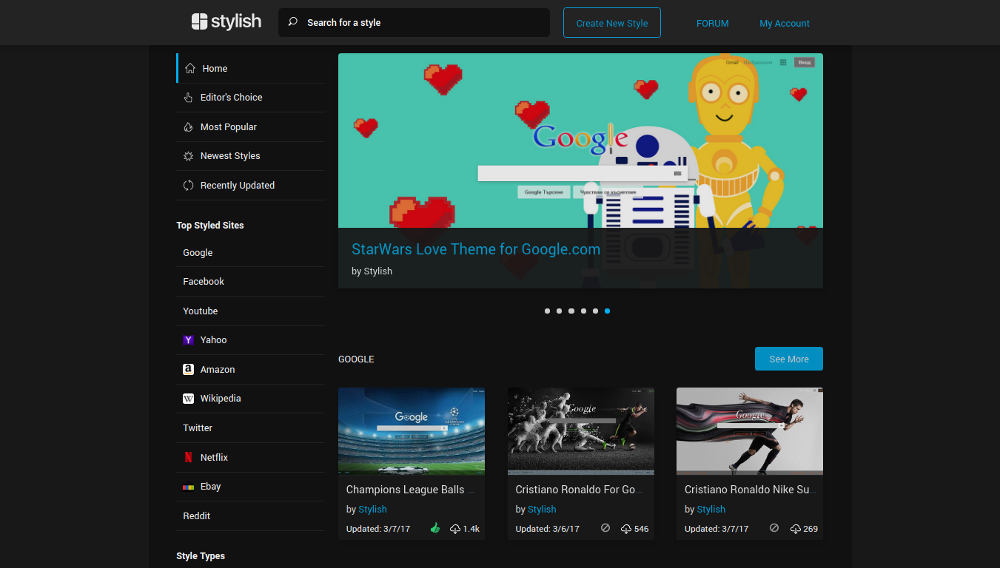
Most popular
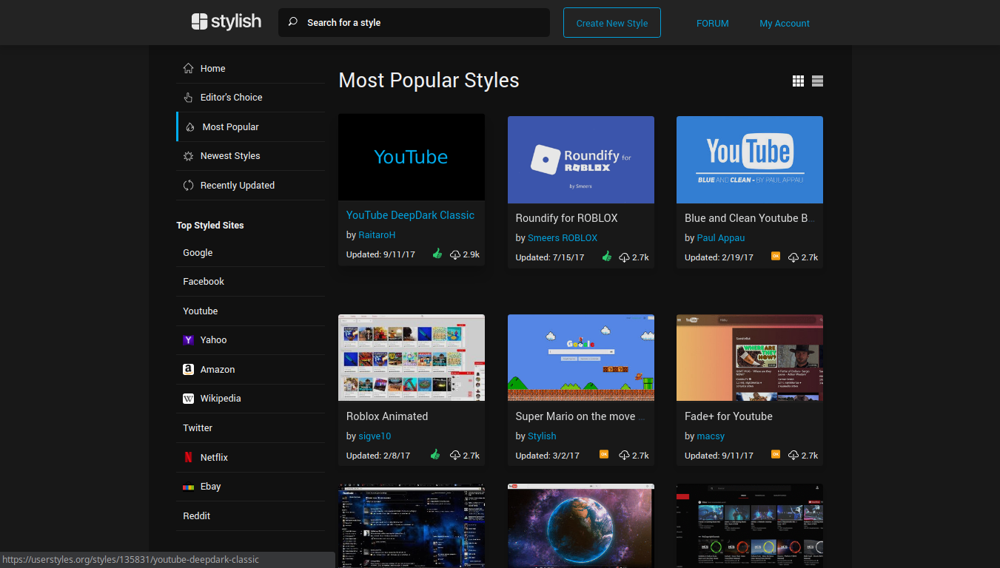
Style Page

Under the forum:

Discussions
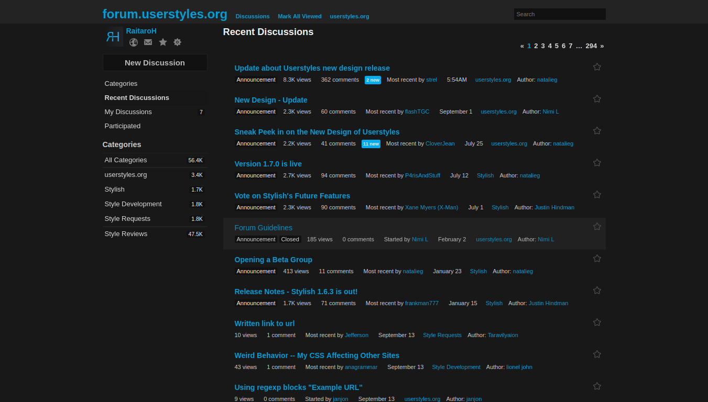
Comments
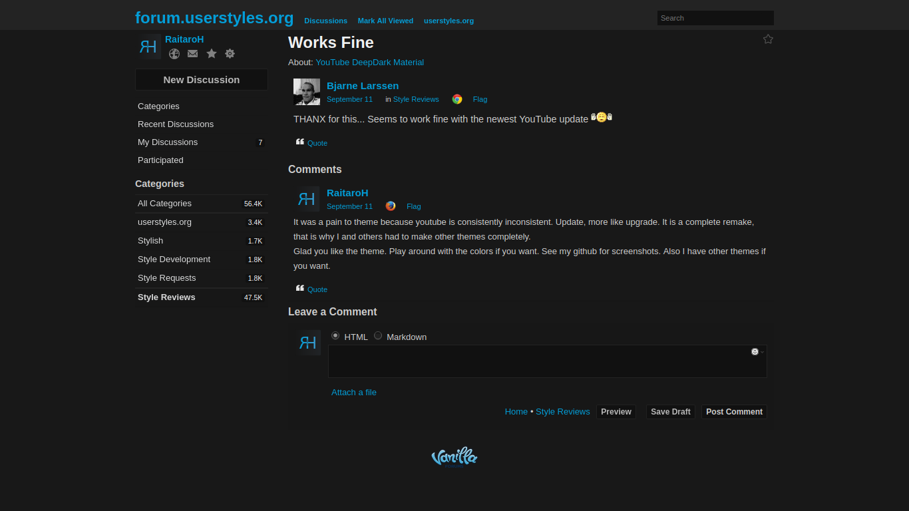
Search
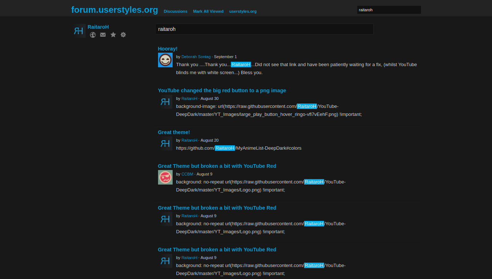

# Colors 
The colors are available in the code; different colors can be used.

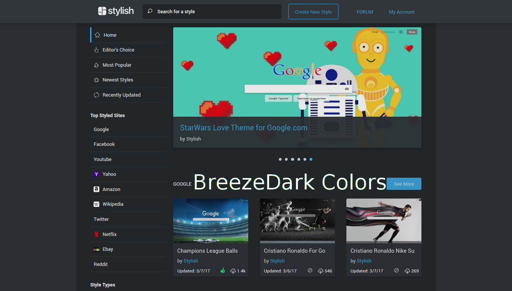
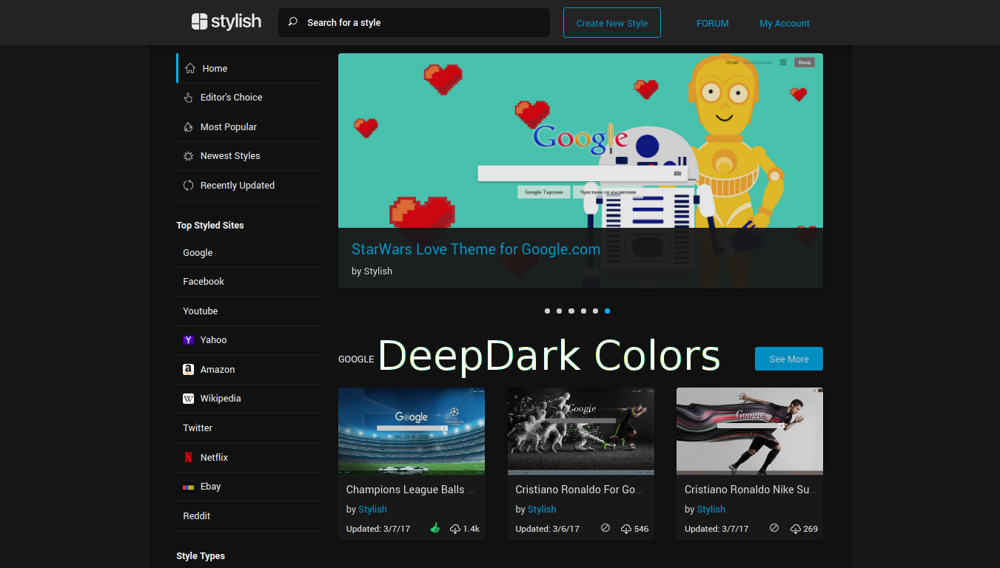
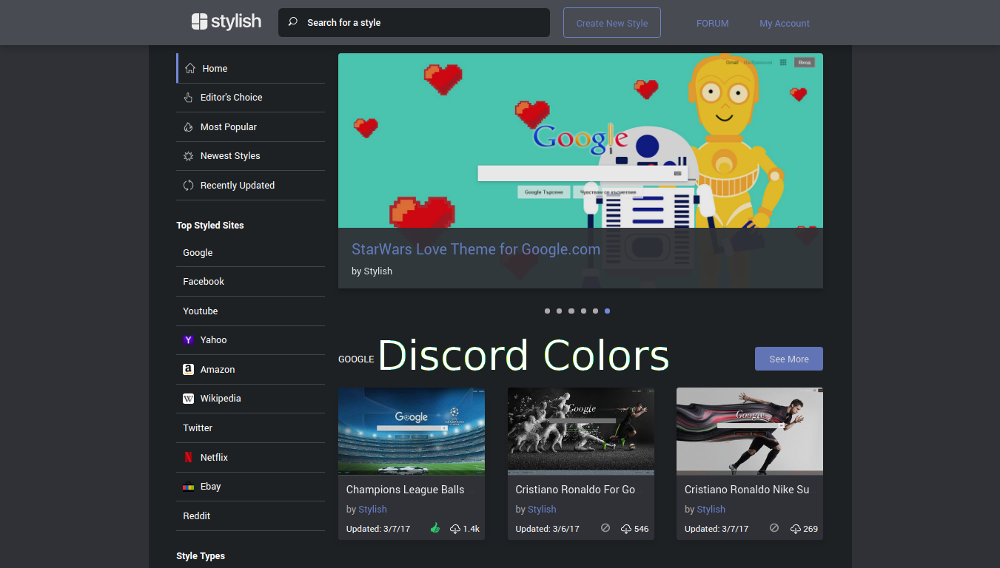
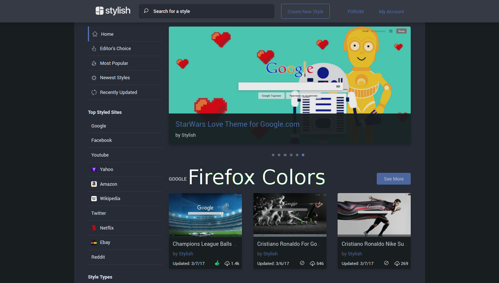
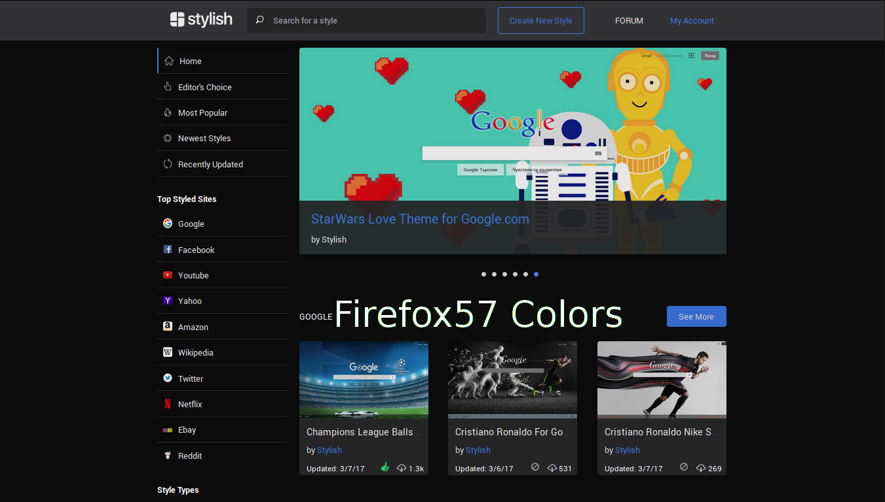
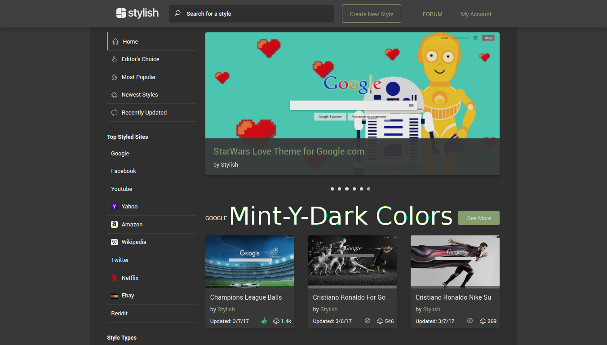
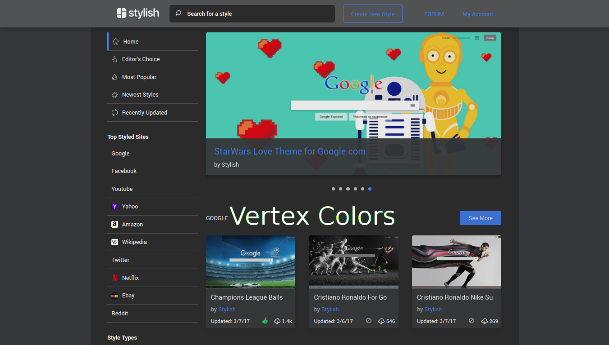

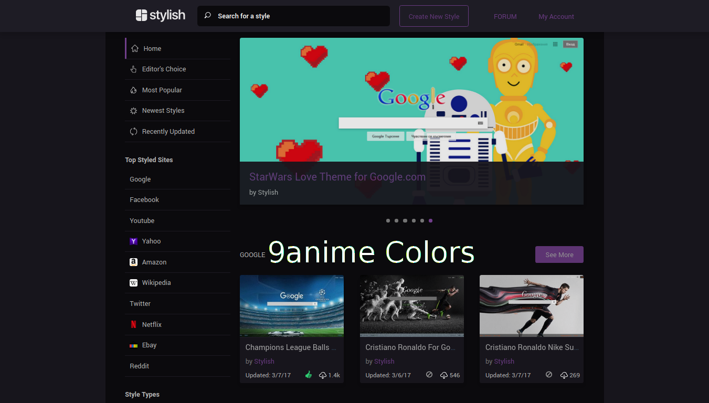

The colors in the edit css mode are also themed:
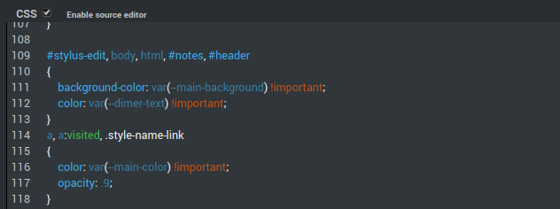
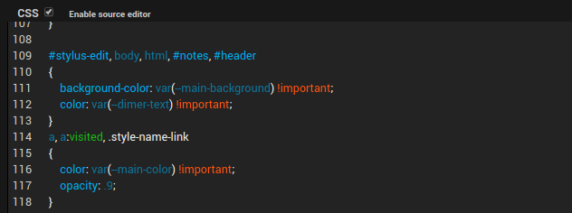
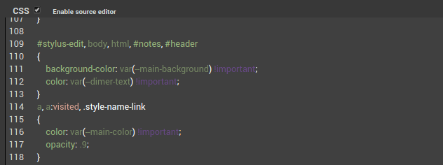
